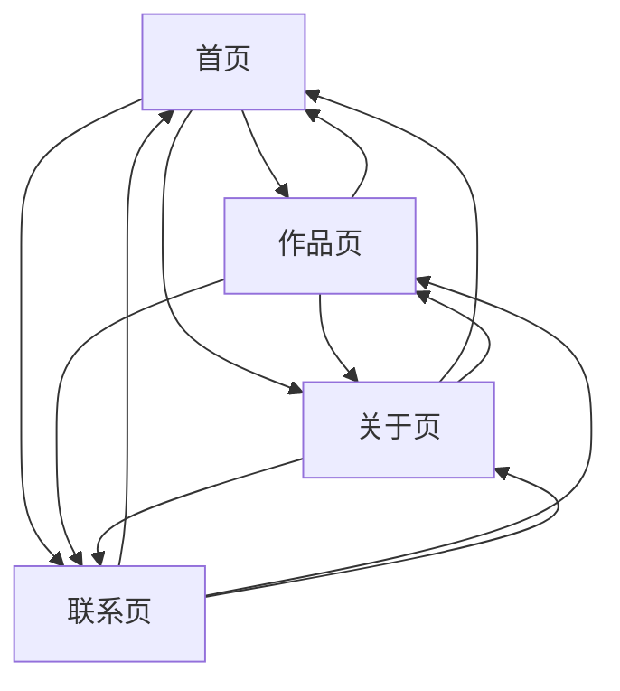

## 1. Product Overview
为你的四页作品集提供统一的“标签页/书签式”导航升级：等宽字体、克制交互、背景色 #f7f6f3，并保持现有卡片圆角与整体气质一致。

## 2. Core Features

### 2.1 Feature Module
作品集需求由以下主要页面构成：
1. **首页**：统一导航（标签页/书签）、核心导语/定位、精选作品入口。
2. **作品页**：统一导航、作品卡片列表（保持现有圆角/卡片风格）、作品详情入口。
3. **关于页**：统一导航、个人简介与能力摘要、简历/下载入口（如现有）。
4. **联系页**：统一导航、联系方式与外链（如现有）、邮件/表单入口（如现有）。

### 2.3 Page Details
| Page Name | Module Name | Feature description |
|-----------|-------------|---------------------|
| 全局（四页共用） | 统一导航组件（标签页/书签式） | 显示四个等宽字体标签；高亮当前页；提供清晰可点击区域；保持视觉克制（无夸张动效）。 |
| 全局（四页共用） | 视觉规范对齐 | 应用页面背景色 #f7f6f3；保持现有卡片圆角不变；确保导航与卡片在颜色/阴影/边框上同一体系。 |
| 全局（四页共用） | 可用性与无障碍 | 支持键盘 Tab 导航与可见焦点态；为当前页设置 aria-current；对比度满足可读性。 |
| 首页 | 导航落位与信息层级 | 在首屏/页头放置统一导航；保证标题与导语优先级高于导航装饰。 |
| 作品页 | 导航与内容协同 | 导航固定一致位置与宽度；不挤压作品卡片主内容区；导航状态变化不引发大幅布局跳动。 |
| 关于页 | 导航一致性 | 复用同一导航组件与样式；页面结构不因导航变更产生额外分栏。 |
| 联系页 | 导航一致性 | 复用同一导航组件与样式；保留现有联系模块交互方式（如果已有）。 |

## 3. Core Process
你的访客进入任一页面后，通过页头的标签页/书签式导航在四个页面之间快速切换；当前页以“选中标签”方式呈现，交互反馈仅用于提示可点击与当前位置，不喧宾夺主。

