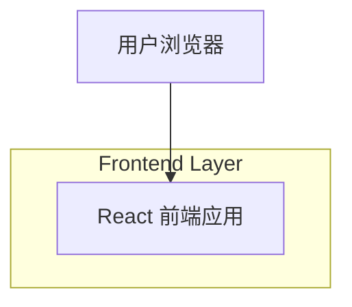

## 1.Architecture design

## 2.Technology Description
- Frontend: React@18 + TypeScript + Vite
- Backend: None

## 3.Route definitions
| Route | Purpose |
|-------|---------|
| / | 首页（统一导航 + 首屏内容） |
| /projects | 作品页（统一导航 + 作品列表/入口） |
| /about | 关于页（统一导航 + 简介内容） |
| /contact | 联系页（统一导航 + 联系方式/外链） |

## 6.Data model(if applicable)
不涉及数据库与数据建模（静态内容/本地数据源即可满足）。

### 实现要点（与本次“导航升级”直接相关）
- 组件化：抽象 `UnifiedNav`（四个 Tab 项、active 状态、aria-current）。
- 样式策略：使用 CSS variables/Design Tokens（含 `--bg: #f7f6f3`、圆角 token 与现有卡片保持一致）；导航与卡片共用 token。
- 交互克制：仅提供 hover/active/focus 的轻量反馈；默认遵循 `prefers-reduced-motion`。
- 可访问性：Tab 顺序正确、可见焦点、点击区域足够；语义用 `<nav>` + `<a>`；当前页 `aria-current="page"`。
- 路由集成：使用前端路由（如 React Router）或静态站点路由能力；导航只负责跳转与状态展示，不承载额外业务逻辑。